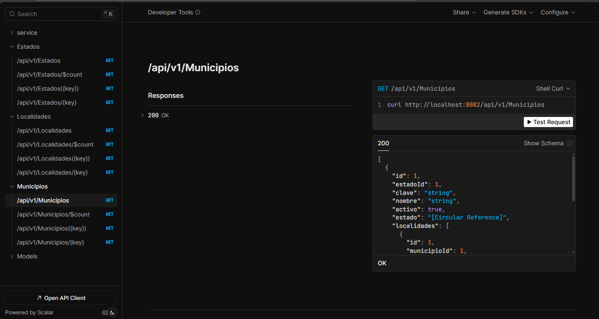
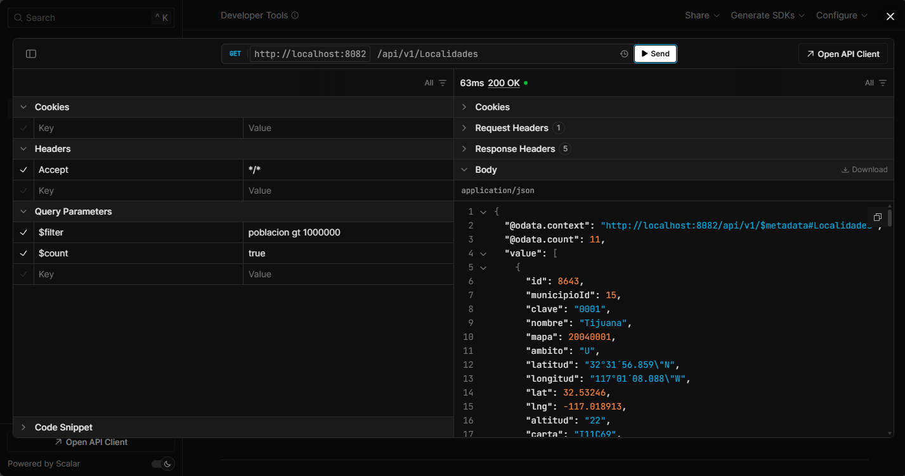

# Servicio OData AGEEML

Este servicio expone los datos de AGEEML mediante endpoints OData (v4) para Estados, Municipios y Localidades.

## Requisitos

- .NET SDK (8.0+ recomendado)
- Una base de datos configurada (por defecto SQLite en `sqlite/ageeml.db`)

### Instalar .NET SDK

Descarga e instala el .NET SDK desde:
- https://dotnet.microsoft.com/download

Verifica la instalación:

```bash
dotnet --version
```

## Ejecutar con dotnet

Desde la raíz del repo:

```bash
dotnet run --project ageeml-odata-service
```

El endpoint HTTP por defecto (perfil Development) es:

```
http://localhost:5155
```

### Configuración (appsettings, user-secrets, variables de entorno)

Puedes configurar el servicio con los mismos mecanismos estándar de ASP.NET Core. Orden típico de precedencia (de menor a mayor):

- `appsettings.json`
- `appsettings.{Environment}.json`
- user-secrets (solo en Development)
- variables de entorno
- argumentos de línea de comandos

Para cambiar la base de datos, sobrescribe estas opciones:

- `Database__Provider` (sqlite | mysql | postgres | postgresql)
- `Database__ConnectionString`

Ejemplo:

```bash
Database__Provider=sqlite \
Database__ConnectionString="Data Source=sqlite/ageeml.db" \
  dotnet run --project ageeml-odata-service
```

## Construir la imagen Docker

Desde la raíz del repo:

```bash
docker build -t {imageName}:{tag} -f ageeml-odata-service/Dockerfile .
```

Ejecutar la imagen (ajusta puertos y variables de entorno según necesites):

```bash
docker run --rm -p 8082:8080 {imageName}:{tag}
```

## Endpoints OData

Prefijo base:

```
/api/v1
```

Conjuntos de entidades:

- `GET /api/v1/Estados`
- `GET /api/v1/Municipios`
- `GET /api/v1/Localidades`

Entidad individual por clave (ambas formas):

- `GET /api/v1/Estados(1)` o `GET /api/v1/Estados/1`
- `GET /api/v1/Municipios(1)` o `GET /api/v1/Municipios/1`
- `GET /api/v1/Localidades(1)` o `GET /api/v1/Localidades/1`

Conteo de entidades:

- `GET /api/v1/Estados/$count`
- `GET /api/v1/Municipios/$count`
- `GET /api/v1/Localidades/$count`

## Opciones de consulta OData

Puedes usar parámetros OData para filtrar, dar forma y paginar resultados. Los nombres de propiedades están en lowerCamelCase (por ejemplo, `estadoId`, `municipioId`, `nombre`).

- `$top`: limita el número de resultados
- `$skip`: omite N resultados
- `$skiptoken`: continúa paginación controlada por el servidor (usa el valor de `@odata.nextLink`)
- `$filter`: filtra filas
- `$compute`: calcula expresiones y las proyecta
- `$expand`: incluye entidades relacionadas
- `$select`: limita los campos devueltos
- `$count`: devuelve el conteo de entidades filtradas

Ejemplos:

- Límite y salto:
  - `/api/v1/Estados?$top=10&$skip=20`
- Filtrar por llave foránea:
  - `/api/v1/Municipios?$filter=estadoId eq 1`
- Filtrar por texto:
  - `/api/v1/Localidades?$filter=contains(nombre,'San')`
- Filtrar por texto:
  - `/api/v1/Localidades?$filter=contains(tolower(nombre),'san')`
- Calcular un campo:
  - `/api/v1/Localidades?$compute=lat add lng as latLngSum&$select=id,lat,lng,latLngSum`
- Expandir entidades relacionadas:
  - `/api/v1/Municipios?$expand=estado`
  - `/api/v1/Localidades?$expand=municipio($select=id,nombre)`
- Seleccionar campos:
  - `/api/v1/Estados?$select=id,nombre`

Para `$skiptoken`, sigue el valor de `@odata.nextLink` de una respuesta paginada y consúmelo tal cual.

## Referencias del protocolo OData

Consulta la especificación oficial del protocolo OData v4.01 para más detalles sobre las reglas de URL y opciones de consulta:

- https://docs.oasis-open.org/odata/odata/v4.01/odata-v4.01-part1-protocol.html#_Toc31358914

## Capturas (Scalar)

Página principal de Scalar:



Consulta en Scalar con filtro y conteo:


